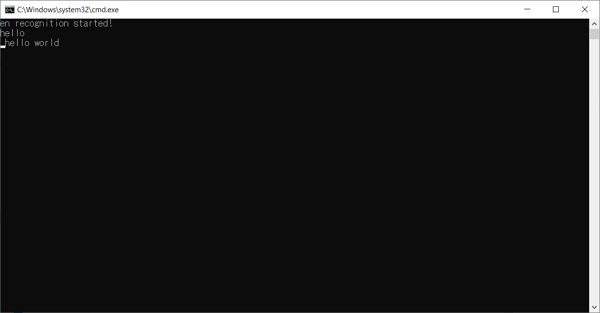

# Unity_live_caption
Use Google Speech-to-Text API to do real-time live stream caption on Unity! Best when combined with your virtual character!

**Important notice before you continue : The speech to text API is NOT free! The pricing guide is [here](https://cloud.google.com/speech-to-text/pricing).**

The [youtube livestream](https://www.youtube.com/watch?v=AZsUm_cuj9U) that demos and explains how this works (explanation in Chinese, caption in Chinese/Japanese/English/French).

Currently, the live caption is done in `python` and the result is sent to unity in real time. There might be a way to do everything in `C#`, maybe [this](https://github.com/GoogleCloudPlatform/dotnet-docs-samples/tree/master/speech/api) but I did in `python` because of some reasons:
1.  I'm not fluent in C#.
2.  Doing speech recognition in another program allows to start/turn off the recognition at any time, and also allows to change the language at wish without restarting unity `.exe`.
3.  There is already an asset which claims that it can do this (I don't know if it can do real time recognition though).

## Pre-requisite

As this process uses Google Cloud API, you need to have an google account.

Follow the [website](https://cloud.google.com/speech-to-text/) to activate the `Speech-to-Text` API in the console, and download the API key, which should be a `.json` file. I will refer this key to be `key.json` in the following.

Next, there are command line (CLI) version and GUI versions of this program. The code is the same but there are some performance differences:

CLI: file size is small and allows more customization.

GUI: file size is large (about 250MB) and takes some time to warm-up the speech to text program.

Here is the tutorial of command line usage. For GUI users, please jump to [here](#GUI-usage).

## Installation

Make sure you have python. If not, installation is recommended via [Anaconda](https://www.anaconda.com/distribution/) with python version 3.

Run `pip install -r requirements.txt` to install python dependencies.

## Usage

1.  Test if speech recognition works in python:
    1. Change [here](https://github.com/kwea123/Unity_live_caption/blob/master/googlesr.py#L9) to where your `key.json` is located.
    2. Run `python googlesr.py --debug --lang_code={YOUR LANGUAGE CODE}`. For the language codes, check [here](https://cloud.google.com/speech-to-text/docs/languages). You should see the recognition output on the console.

2.  Output the recognition result to unity:
    1.  Create a Text component via `GameObject->UI->Text`.
    2.  Attach `subtitleListener.cs` to it.
    3.  Run the unity program **FIRST**, either in editor or executable, then run `python googlesr.py --lang_code={YOUR LANGUAGE CODE} --connect`. You should see the recognition output now in unity. You can stop and restart the recognition anytime by pressing `Ctrl` and `c` in the python console without affecting the unity program at all.
    
3.  **Remember to stop the python program when you finish the work, otherwise it is going to keep charging you! I disclaim any reponsibility of the induced charges by using my program.**
    
## Customization

1.  You can change the connection port by changing the port number (default 5067) [here](https://github.com/kwea123/Unity_live_caption/blob/master/googlesr.py#L127) and [here](https://github.com/kwea123/Unity_live_caption/blob/master/subtitleListener.cs#L18)

2.  You can change how the text is printed on unity [here](https://github.com/kwea123/Unity_live_caption/blob/master/subtitleListener.cs#L73-L79) and [here](https://github.com/kwea123/Unity_live_caption/blob/master/subtitleListener.cs#L36-L39). The default is configured to print at most 32 characters in Chinese, so you might need to change if you're not using Chinese.

## GUI usage

1.  Download `googlesr_gui_english.zip` from [here](https://github.com/kwea123/Unity_live_caption/releases/tag/v1.0).

2.  Open `googlesr_gui_english.exe` and you will see

3.  Select your language, set the API key and select whether to connect to unity and/or print to console.

4.  Press Start to start. It takes some time to warm-up. When it's ready, you will see the following and you can start to talk. You can adjust the size of this window.

5.  Press `Ctrl` and `c` to stop the program when you finish.

6.  **Remember to stop the program when you finish the work, otherwise it is going to keep charging you! I disclaim any reponsibility of the induced charges by using my program.**

## Other issues
Please ask in [issue](https://github.com/kwea123/Unity_live_caption/issues)

